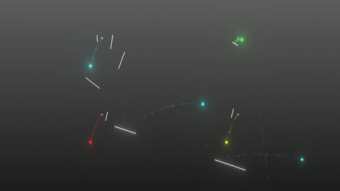

# balldrop.
An experimental musical instrument, made with Godot 3.1.

Do you remember [BallDroppings](http://www.thaoh.net/BallDroppings/)? I decided to make something similar in Godot, adding some more features and more polished graphics. It turned out to be quite fun to play with, and given some patience you can actually make some cool music with it.

The idea is that there are multiple emitters on the screen that periodically spawn balls. When the balls touch a line, a sound is emitted. The kind of sound depends on the color of the ball, and the pitch of the sound depends on the velocity of the ball.

You can draw lines by holding the left mouse button and erase them again by pressing the right mouse button.

[Here's a video of it in action.](https://www.youtube.com/watch?v=yhKnGPcZmE4)

# License
The code is MIT, the sound effects are CC0 (they were found on Freesound).
